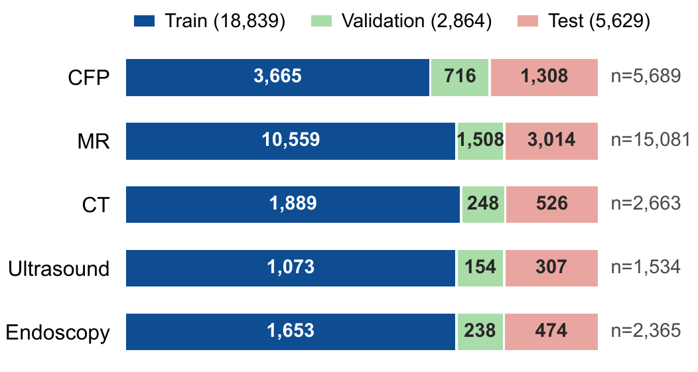
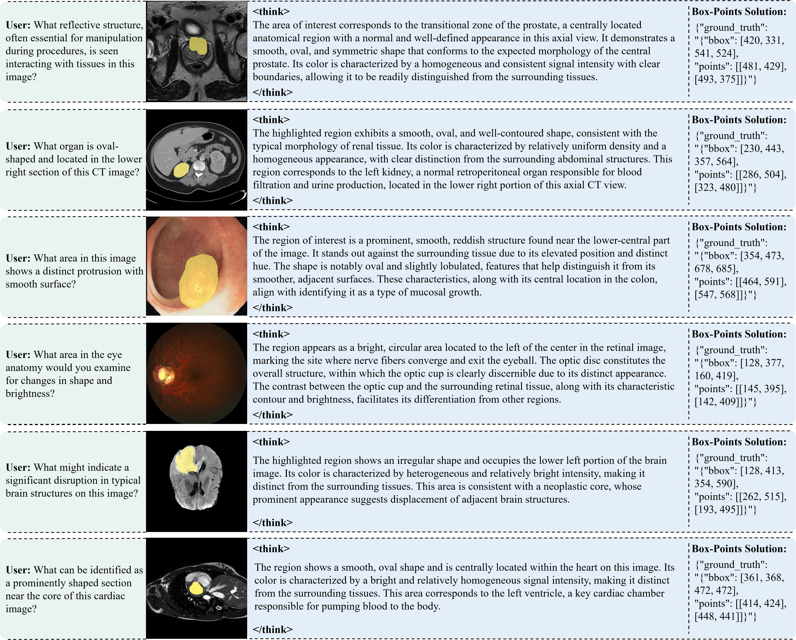
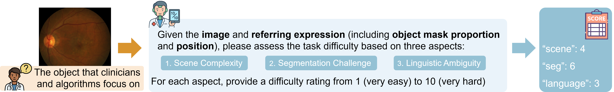

# MRIS-Bench Data Sources and Supplementary Material

This page consolidates the public data sources, dataset-construction protocol, annotation procedure, quality-control process, and supplementary statistics for **MRIS-Bench**.

Dataset: <https://huggingface.co/datasets/lixiang007666/MRIS-Bench>

> **Note:** If you use any of these datasets, follow the citation and usage guidelines provided by the original dataset authors.

## Construction of MRIS-Bench

MRIS-Bench construction involves four aligned forms of annotations and metadata: dense pixel-level masks, mask-derived sparse geometry, implicit referring expressions, and sample-level difficulty estimates. The dense masks are primarily used to derive sparse spatial supervision, including bounding boxes and key points, and to evaluate segmentation performance, rather than being directly used as training supervision for Think-MRIS. This design avoids direct optimization based on dense pixel-level annotations, encouraging the model to rely more on language understanding, spatial localization, and reasoning to identify and segment the target. Accordingly, each MRIS-Bench instance pairs an image-query input $(I,Q)$ with a target mask $M$, a tight bounding box $B$, two interior key points $P_1$ and $P_2$, and a task-difficulty score $D$. No ground-truth chain-of-thought (CoT) trace $T$ is annotated; instead, ERPO elicits the model's own reasoning through format-, localization-, and length-aware reward signals.

*Figure 1. Modality-specific distribution of image-query instances across the training, validation, and test splits of MRIS-Bench.*

### Public Data Sources and Harmonization

MRIS-Bench combines 24 public source datasets spanning CFP, MR, CT, ultrasound, and endoscopy. Figure 1 summarizes the modality-specific split statistics, and Table 1 reports all annotated targets and modalities. Figure 2 shows representative examples. RUNMC, BMC, I2CVB, UCL, and BIDMC are five distinct prostate datasets grouped in one row for compactness, whereas the MR and CT subsets of MM-WHS are listed separately but counted as one source.

*Figure 2. Representative cases from MRIS-Bench. Each target provides a referring expression and mask-derived box and key points; the displayed CoT illustrates model reasoning and is not a dataset annotation.*

**Table 1.** Public data sources and modality-specific subsets used to construct MRIS-Bench. The 25 named entries correspond to 24 unique source datasets because MM-WHS contributes both MR and CT subsets. Together, these sources cover 24 target categories across five imaging modalities.

| Source dataset or subset | Annotated target(s) | Modality |
|---|---|---|
| RIM_ONE_r3 [1] | Optic disc and optic cup | CFP |
| REFUGE [2] | Optic disc and optic cup | CFP |
| ORIGA [3] | Optic disc and optic cup | CFP |
| Drishti_GS [4] | Optic disc and optic cup | CFP |
| MAPLES-DR [21] | Macula | CFP |
| DDR [22] | Hemorrhage, hard exudate, and soft exudate | CFP |
| MM-WHS-MRI [5] | Cardiac structures | MR |
| BraTS2020 [6] | Brain tumor | MR |
| ADAM [7] | Intracranial aneurysm | MR |
| CHAOS [8] | Abdominal organs | MR |
| RUNMC, BMC, I2CVB, UCL, and BIDMC [13-15] | Prostate | MR |
| MM-WHS-CT [5] | Cardiac structures | CT |
| BTCV [9] | Abdominal organs | CT |
| NSCLC [10] | Lung | CT |
| LiTS [11] | Liver tumor | CT |
| KiTS 2023 [12] | Kidney tumor | CT |
| CAMUS [16] | Cardiac structures | Ultrasound |
| BKAI [17] | Polyp | Endoscopy |
| CVC-ClinicDB [18] | Polyp | Endoscopy |
| ETIS-LaribPolypDB [19] | Polyp | Endoscopy |
| Kvasir-SEG [20] | Polyp | Endoscopy |

We retain source-provided pixel annotations and official train/test partitions whenever available. For all volumetric MR and CT datasets, train/test partitioning is applied at the volume level before 2D slice extraction. The 10% validation subset is likewise selected by volume from the aggregated training partition, ensuring that every slice from a given volume remains in a single split. Native 2D images remain unchanged in dimensionality, whereas each volumetric scan is converted into 2D slices with its corresponding masks. After harmonization, volumetric slices without foreground pixels for the annotated target are discarded, and the remaining samples are manually checked to confirm the presence of the segmentation target before constructing referring expressions and sparse geometric annotations. During preprocessing, each image, mask, and sparse geometric annotation undergoes the same resizing and coordinate transformation.

### Mask-Derived Spatial Supervision

To construct the sparse geometry required by ERPO and SAM, we deterministically derive one box and two interior points from every target mask. The box is the minimum axis-aligned rectangle enclosing all target pixels. For point selection, we compute the Euclidean distance transform inside the mask and choose the deepest interior maximum as $P_1$. We then select $P_2$ as the spatially farthest pixel among candidates whose distance-transform value is at least half that of $P_1$; all foreground pixels are used as a fallback when fewer than two such candidates exist. This procedure reduces sensitivity to boundary noise while guaranteeing that both points remain inside the target. Because the sparse annotations are entirely mask-derived, they require no additional manual localization labels.

### Implicit Referring-Expression Construction

For each image-mask pair, we organize target-level metadata comprising the imaging modality, anatomical or pathological category, and segmentation label. We use LLaVA-Med v1.5 [23] to automatically generate medical text prompts for the segmentation target. Its instruction template is:

> *You are a medical expert. Please describe the [attribute 1], [attribute 2], ..., [attribute $N_p$] of this anatomical structure in {modality}, using one sentence for each attribute.*

Based on this template, we generate $N_p$ attribute-specific prompts for the target object. We set $N_p=3$, with [attribute 1] = [profile], [attribute 2] = [shape], and [attribute 3] = [color]. The profile describes organ function or provides a concise definition of a lesion, whereas shape and color characterize the target's morphology and visual appearance, respectively. For grayscale modalities, color is interpreted as intensity or echogenicity. GPT-4o [24] then integrates these prompts with the target metadata and spatial context to formulate an implicit clinical referring expression.

The resulting query identifies the target through functional, morphological, appearance, or positional cues rather than directly exposing its class name. Anatomical targets emphasize normal structure and spatial relations, whereas pathological targets emphasize abnormal appearance and lesion extent without introducing unsupported diagnoses. The generated text serves only as the referring query $Q$, not as a ground-truth reasoning trace; policy optimization remains supervised by mask-derived geometry, and ERPO elicits the model's own CoT.

### Difficulty Annotation and Quality Control

For each image-query pair, Qwen2.5-VL-72B [25] receives the image, referring expression, and mask-derived target proportion and position, and independently scores scene complexity, segmentation challenge, and linguistic ambiguity. Each score lies in $[1,10]$, and their arithmetic mean defines $D$. Figure 3 summarizes the scoring prompt and its structured output. On 300 samples spanning all five modalities, the resulting scores achieve a Spearman correlation of $\rho=0.89$ with human ratings. The scores are stored only as training metadata for ERPO's adaptive token allocation; neither the external scorer nor $D$ is required at inference.

Quality control combines deterministic geometry checks with manual text review. Empty or invalid masks are excluded; every derived box must enclose the complete foreground, and both key points must remain inside the target after coordinate transformation. All generated expressions are independently reviewed against the image and annotated region by two junior physicians, who flag unsupported content and unintentionally ambiguous or clinically inconsistent wording. One senior physician adjudicates disagreements and verifies the final revisions.

*Figure 3. Difficulty annotation procedure for MRIS-Bench. Given an image, its referring expression, and mask-derived target proportion and position, Qwen2.5-VL-72B independently assigns scores from 1 (very easy) to 10 (very hard) for scene complexity, segmentation challenge, and linguistic ambiguity.*

## Segmentation Super-Categories in U-MRG-14K

U-MRG-14K [26] defines ten super-categories for segmentation evaluation. We preserve this original taxonomy without merging, reassigning, or relabeling instances, ensuring that our evaluation remains directly comparable with the benchmark setting. Specifically, the ten categories are *abdomen anatomies*, *brain anatomies*, *eye anatomies*, *heart anatomies*, *histology structure*, *lung*, *vessel*, *neoplasm*, *non-neoplasm*, and *infection*. These categories cover both anatomical structures and pathological targets and provide a unified basis for category-wise performance analysis. Table 2 reports the corresponding data distribution for each super-category, comprising 11,076 training and 2,223 test instances in total.

**Table 2.** Distribution of the ten U-MRG-14K super-categories across the training and test sets. Counts denote image-query instances.

| Super-category | Train set | Test set |
|---|---:|---:|
| Abdomen anatomies | 2,849 | 569 |
| Brain anatomies | 422 | 76 |
| Eye anatomies | 377 | 75 |
| Heart anatomies | 1,887 | 411 |
| Histology structure | 828 | 166 |
| Lung | 819 | 166 |
| Vessel | 508 | 84 |
| Neoplasm | 1,307 | 256 |
| Non-neoplasm | 1,249 | 230 |
| Infection | 830 | 190 |
| **Total** | **11,076** | **2,223** |

## References

[1] Fumero, Francisco, Silvia Alayón, José L. Sanchez, Jose Sigut, and M. Gonzalez-Hernandez. “RIM-ONE: An open retinal image database for optic nerve evaluation.” *2011 24th International Symposium on Computer-Based Medical Systems (CBMS)*, 1–6, 2011.

[2] Orlando, José Ignacio, Huazhu Fu, João Barbosa Breda, Karel Van Keer, Deepti R. Bathula, Andrés Diaz-Pinto, Ruogu Fang, et al. “REFUGE challenge: A unified framework for evaluating automated methods for glaucoma assessment from fundus photographs.” *Medical Image Analysis* 59 (2020): 101570.

[3] Zhang, Zhuo, Feng Shou Yin, Jiang Liu, Wing Kee Wong, Ngan Meng Tan, Beng Hai Lee, Jun Cheng, and Tien Yin Wong. “ORIGA-light: An online retinal fundus image database for glaucoma analysis and research.” *2010 Annual International Conference of the IEEE Engineering in Medicine and Biology*, 3065–3068, 2010.

[4] Sivaswamy, Jayanthi, S. R. Krishnadas, Gopal Datt Joshi, Madhulika Jain, and A. Ujjwaft Syed Tabish. “Drishti-GS: Retinal image dataset for optic nerve head (ONH) segmentation.” *2014 IEEE 11th International Symposium on Biomedical Imaging (ISBI)*, 53–56, 2014.

[5] Zhuang, Xiahai. “Multivariate mixture model for myocardial segmentation combining multi-source images.” *IEEE Transactions on Pattern Analysis and Machine Intelligence* 41, no. 12 (2018): 2933–2946.

[6] Mehta, Raghav, Angelos Filos, Ujjwal Baid, Chiharu Sako, Richard McKinley, Michael Rebsamen, Katrin Dätwyler, et al. “QU-BraTS: MICCAI BraTS 2020 challenge on quantifying uncertainty in brain tumor segmentation—analysis of ranking scores and benchmarking results.” *The Journal of Machine Learning for Biomedical Imaging* (2022).

[7] Timmins, Kimberley M., Irene C. van der Schaaf, Edwin Bennink, Ynte M. Ruigrok, Xingle An, Michael Baumgartner, Pascal Bourdon, et al. “Comparing methods of detecting and segmenting unruptured intracranial aneurysms on TOF-MRAs: the ADAM challenge.” *NeuroImage* 238 (2021): 118216.

[8] Kavur, A. Emre, N. Sinem Gezer, Mustafa Barış, Sinem Aslan, Pierre-Henri Conze, Vladimir Groza, Duc Duy Pham, et al. “CHAOS challenge—combined (CT-MR) healthy abdominal organ segmentation.” *Medical Image Analysis* 69 (2021): 101950.

[9] Landman, Bennett, Zhoubing Xu, Juan Eugenio Igelsias, M. Styner, T. Langerak, and A. Klein. “Segmentation outside the cranial vault challenge.” *MICCAI: Multi Atlas Labeling Beyond Cranial Vault—Workshop Challenge*, 2015.

[10] Kiser, Kendall, Sara Ahmed, Sonja M. Stieb, Abdallah A. S. R. Mohamed, Hesham Elhalawani, Peter Park, Nathan S. Doyle, et al. “Thoracic volume and pleural effusion segmentations in diseased lungs for benchmarking chest CT processing pipelines.” *The Cancer Imaging Archive*, 2020.

[11] Bilic, Patrick, Patrick Christ, Hongwei Bran Li, Eugene Vorontsov, Avi Ben-Cohen, Georgios Kaissis, Adi Szeskin, et al. “The liver tumor segmentation benchmark (LiTS).” *Medical Image Analysis* 84 (2023): 102680.

[12] Heller, Nicholas, Fabian Isensee, Resha Tejpaul, Andrew Wood, Nikolaos Papanikolopoulos, and Christopher Weight. *2023 Kidney and Kidney Tumor Segmentation Challenge*. Zenodo, April 2023.

[13] Bloch, Nicholas, Anant Madabhushi, Henkjan Huisman, John Freymann, Justin Kirby, et al. “NCI-ISBI 2013 challenge: Automated segmentation of prostate structures.” *The Cancer Imaging Archive* 5 (2015).

[14] Litjens, Geert, Robert Toth, Wendy Van De Ven, Caroline Hoeks, Sjoerd Kerkstra, Bram Van Ginneken, Graham Vincent, et al. “Evaluation of prostate segmentation algorithms for MRI: the PROMISE12 challenge.” *Medical Image Analysis* 18, no. 2 (2014): 359–373.

[15] Lemaître, Guillaume, Robert Martí, Jordi Freixenet, Joan C. Vilanova, Paul M. Walker, and Fabrice Meriaudeau. “Computer-aided detection and diagnosis for prostate cancer based on mono and multi-parametric MRI: a review.” *Computers in Biology and Medicine* 60 (2015): 8–31.

[16] Leclerc, Sarah, Erik Smistad, Joao Pedrosa, Andreas Østvik, Frederic Cervenansky, Florian Espinosa, Torvald Espeland, et al. “Deep learning for segmentation using an open large-scale dataset in 2D echocardiography.” *IEEE Transactions on Medical Imaging* 38, no. 9 (2019): 2198–2210.

[17] Ngoc Lan, Phan, Nguyen Sy An, Dao Viet Hang, Dao Van Long, Tran Quang Trung, Nguyen Thi Thuy, and Dinh Viet Sang. “NeoUNet: Towards accurate colon polyp segmentation and neoplasm detection.” *International Symposium on Visual Computing*, 15–28, 2021.

[18] Bernal, Jorge, F. Javier Sánchez, Gloria Fernández-Esparrach, Debora Gil, Cristina Rodríguez, and Fernando Vilariño. “WM-DOVA maps for accurate polyp highlighting in colonoscopy: Validation vs. saliency maps from physicians.” *Computerized Medical Imaging and Graphics* 43 (2015): 99–111.

[19] Silva, Juan, Aymeric Histace, Olivier Romain, Xavier Dray, and Bertrand Granado. “Toward embedded detection of polyps in WCE images for early diagnosis of colorectal cancer.” *International Journal of Computer Assisted Radiology and Surgery* 9, no. 2 (2014): 283–293.

[20] Jha, Debesh, Pia H. Smedsrud, Michael A. Riegler, Pål Halvorsen, Thomas De Lange, Dag Johansen, and Håvard D. Johansen. “Kvasir-SEG: A segmented polyp dataset.” *International Conference on Multimedia Modeling*, 451–462, 2019.

[21] Lepetit-Aimon, Gabriel, Clément Playout, Marie Carole Boucher, Renaud Duval, Michael H. Brent, and Farida Cheriet. “MAPLES-DR: MESSIDOR anatomical and pathological labels for explainable screening of diabetic retinopathy.” *Scientific Data* 11, no. 1 (2024): 914.

[22] Li, Tao, Yingqi Gao, Kai Wang, Song Guo, Hanruo Liu, and Hong Kang. “Diagnostic assessment of deep learning algorithms for diabetic retinopathy screening.” *Information Sciences* 501 (2019): 511–522.

[23] Li, Chunyuan, Cliff Wong, Sheng Zhang, Naoto Usuyama, Haotian Liu, Jianwei Yang, Tristan Naumann, Hoifung Poon, and Jianfeng Gao. “LLaVA-Med: Training a large language-and-vision assistant for biomedicine in one day.” *Advances in Neural Information Processing Systems* 36 (2023): 28541–28564.

[24] Hurst, Aaron, Adam Lerer, Adam P. Goucher, Adam Perelman, Aditya Ramesh, Aidan Clark, AJ Ostrow, Akila Welihinda, Alan Hayes, Alec Radford, et al. “GPT-4o system card.” arXiv:2410.21276 (2024).

[25] Bai, Shuai, Keqin Chen, Xuejing Liu, Jialin Wang, Wenbin Ge, Sibo Song, Kai Dang, Peng Wang, Shijie Wang, Jun Tang, et al. “Qwen2.5-VL technical report.” arXiv:2502.13923 (2025).

[26] Yan, Zhonghao, Muxi Diao, Yuxuan Yang, Ruoyan Jing, Jiayuan Xu, Kaizhou Zhang, Lele Yang, Yanxi Liu, Kongming Liang, and Zhanyu Ma. “MedReasoner: Reinforcement learning drives reasoning grounding from clinical thought to pixel-level precision.” *Proceedings of the AAAI Conference on Artificial Intelligence* 40, no. 14 (2026): 11577–11585.
